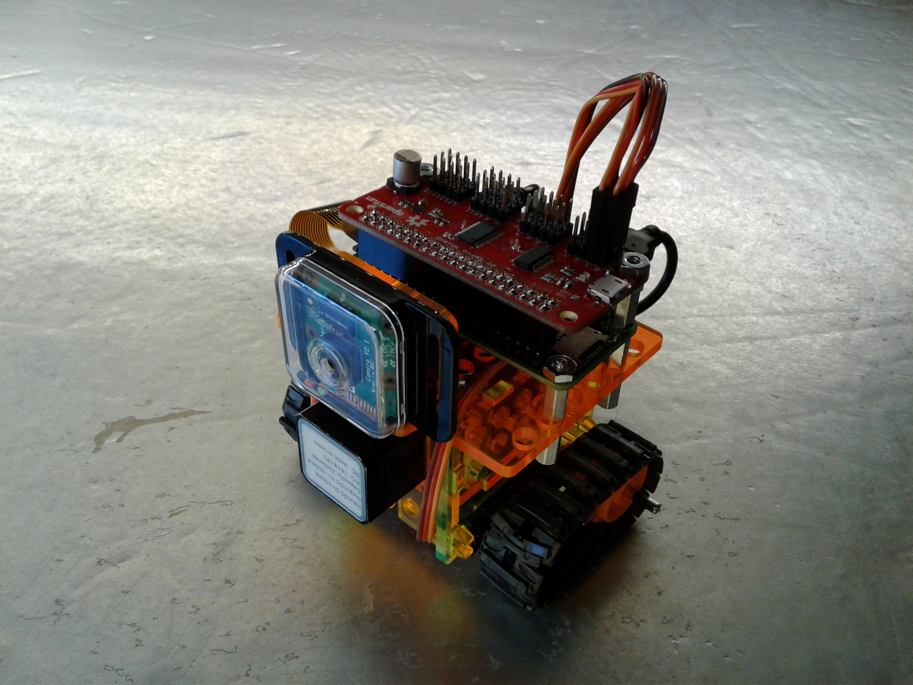

# Quasiboto donkeycar fork: a python self driving library version for the Quasiboto Open Source Robot Platform using differential/tank steering.

Donkeycar is minimalist and modular self driving library for Python. It is
developed for hobbyists and students with a focus on allowing fast experimentation and easy
community contributions.

#### Quick Links
* [Quasiboto Repository](https://github.com/mtedder/Quasiboto)
* [differential steering code derived from this source](https://github.com/autorope/donkeycar/blob/c05e774d0838776705f0fa35fcd90301e8b9f2b2/donkey/mixers.py)
* [And this source] (https://electronics.stackexchange.com/questions/19669/algorithm-for-mixing-2-axis-analog-input-to-control-a-differential-motor-drive)

#### Use Quasiboto Donkey if you want to:
* Make an RC car drive its self.
* Compete in self driving races like [DIY Robocars](http://diyrobocars.com)
* Experiment with autopilots, mapping computer vision and neural networks.
* Log sensor data. (images, user inputs, sensor readings)
* Drive your car via a web or game controller.
* Leverage community contributed driving data.
* Use existing CAD models for design upgrades.

### Get driving.
After building a Quasiboto robot you can turn on your car and go to http://localhost:8887 to drive.

### Modify your cars behavior.
Quasiboto is controlled by running a sequence of events

### Setup and Driving info
Quasiboto setup is the same as for the original donkeycar but the steps are repeated here.
1. Step1
2. Step2
3. Step3
4. Step4
5. Step5

See [home page](http://donkeycar.com), [docs](http://docs.donkeycar.com)
or join the [Slack channel](http://www.donkeycar.com/community.html) to learn more.
